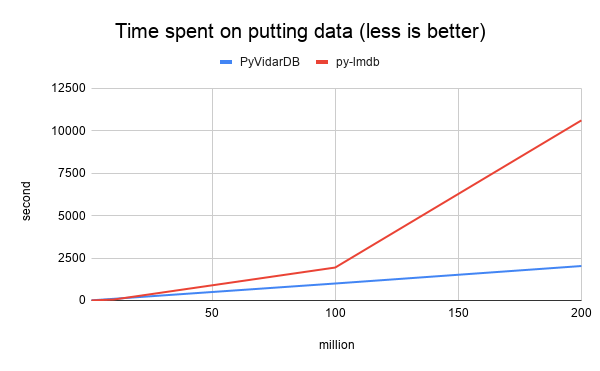
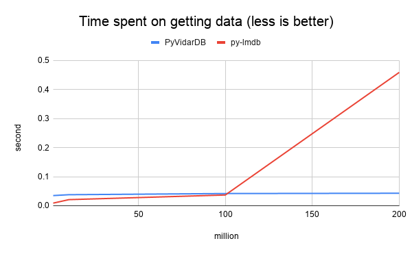
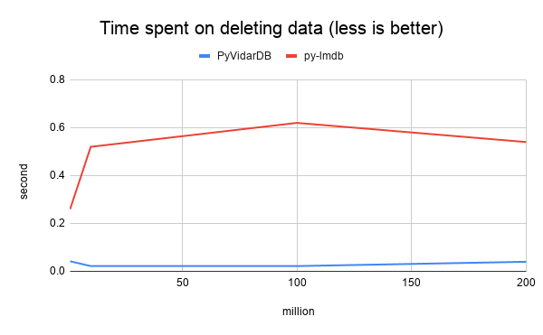
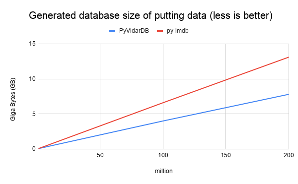

# PyVidarDB

[](https://dev.azure.com/vidardb/PyVidarDB/_build/latest?definitionId=1&branchName=master)

[](https://pypi.org/project/PyVidarDB)

PyVidarDB is a simple, fast, and persistent key-value store that can store terabytes of data. It is the Python binding for [VidarDB](https://github.com/vidardb/vidardb-engine), which is a lineage of LevelDB and RocksDB.

## Why should I try PyVidarDB?

We did experiment with PyVidarDB and [py-lmdb](https://github.com/jnwatson/py-lmdb) to compare the performance of:

- Putting data (inserting key-value pairs from 1 million to 200 million)
- Getting data (getting 5000 random key-value pairs after putting data)
- Deleting data (deleting 5000 random key-value pairs)
- Database size (the size of the database of putting data)

The result turns out: For "big" data scale (in our experiment, the data size larger than 25% of the RAM), PyVidarDB is 
significantly faster than py-lmdb (putting and getting data); it is always faster than py-lmdb at deleting data; the 
database size is always smaller than py-lmdb. In conclusion, PyVidarDB has an obviously better performance than py-lmdb.






Please see [experiment](./experiment) for more information.

## Use PyVidarDB

PyVidarDB guarantees to support `Python >= 3.5`.
There is no need to have VidarDB installed in advance, PyVidarDB will install it automatically for you.

### Dependencies

For Linux users (Ubuntu as an example):

```bash
sudo apt-get update
sudo apt-get install git python3-pip build-essential cmake
```

For MacOS users (Please install [Homebrew](https://brew.sh/) at first):

```bash
sudo brew install git python3 cmake
```

For Windows users:

The compiler should support C++11 (at least Visual Studio 2015 update 3).

### PyVidarDB Installation

From PyPI:

```bash
pip3 install PyVidarDB
```

From Github:

```bash
git clone --recursive https://github.com/vidardb/PyVidarDB.git
pip3 install ./PyVidarDB
```

## Basic Usage

Here is the basic usage for PyVidarDB:

```python
import pyvidardb

db = pyvidardb.DB()

# Open the database, will create one if not exist.
db.open("./hello_world")

# Put a pair of 'key1' and 'value1' into the database.
db.put(b"key1", b"value1")

# Get the value(s) of the provided key, will return None
# if there is no such key in the database.
value = db.get(b"key1")
assert value == [b"value1"]

# 'key2' does not exist in the database. So we will get None here.
value = db.get(b"key2")
assert value is None

# Remove 'key1' from the database.
db.delete(b"key1")

# Put a pair of 'key2' and multiple values into the database.
db.put(b"key2", [b"value1", b"value2", b"value3"])

# Get the value(s) of the provided key.
value = db.get(b"key2")
assert value == [b"value1", b"value2", b"value3"]

# Remove 'key2' from the database.
db.delete(b"key2")

# Close the database.
db.close()
```

More examples can be found at here: https://github.com/vidardb/PyVidarDB/tree/master/examples 

See our [wiki](https://github.com/vidardb/PyVidarDB/wiki) page for more information.
